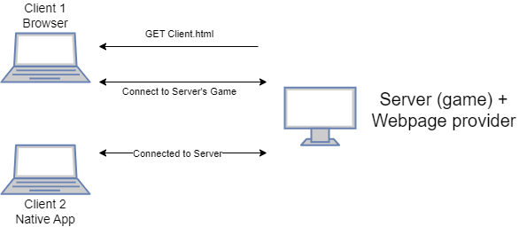

# Realtime Client/Server communication over LAN in a browser
That's what this project showcases.

Out of the three somewhat viable methods I had to do this:
- Http request polling
- Websockets
- WebRTC

WebRTC is the only one that's packet based and doesn't require pesky ACKs that slow down real-time communication.

However: *This has been quite an ordeal.*

### Solution
Roll the webserver serving the client application, a custom signalling subsystem, the application's server system, and the WebRTC peer connection code into a single application.

This is how it works:
1. Provide the client with a client applet (`index.html`) via the webserver (currently [`axum`](https://github.com/tokio-rs/axum))
2. Client POSTs a WebRTC `offer` via `./connect`. The offer is a single communication channel.
3. Webserver communicates with the signalling system to create a response.
    - A WebRTC peer on the server is created from the `offer` with a short lifetime.
    - The `accept` STP message along with the *direct connect* ICE candidates are sent back as a JSON object.
        - These candidates (serverside running `collect_ice_candidates()`) are the Client's IP as seen by the server and the server's LAN IP.
4. Client processes the response and attempts to connect as a WebRTC peer to the server.
5. Server's WebRTC peer accepts the connection.
6. Server's application takes control of the connection and communicates over the channel.


As a side note, this project forced me into `async` Rust (`tokio`) by virtue of `axum` and the [WebRTC](https://github.com/uniciant/just-webrtc/tree/main/crates/just-webrtc) implementation. `async` is an ordeal unto itself, presenting all forms of incompatibilities with other applications. I expect I'll be using `Send`-safe channels and `Arc` liberally to abstract over most of this.

I'm sure webdevs don't think this was all to complex - but its a big step from:
```bash
python -m http.server -d ./web
```
```rust
UdpSocket::bind("192.168.1.100")?
    .send_to("192.168.1.50", &b"Hello")
```

Why can't things be simple like on native apps? All I wanted was a client and a server. I don't need all the additional bells and whistles like hole=punching, ICE relays and direct-video channels, right now. Of course the system has to be so complex. Raw UDP sockets for the web when?

