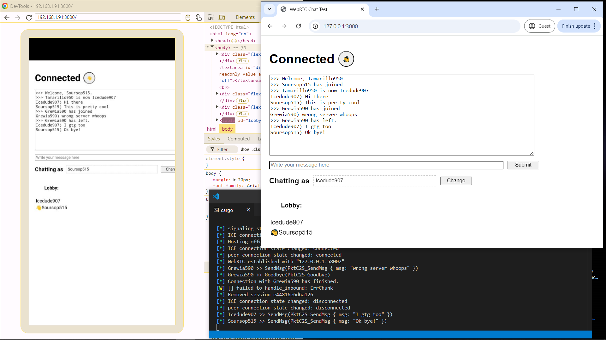

# Realtime Client/Server communication over LAN in a browser
That's what this project showcases.

------

### The theory
Out of the three viable methods I had to do this:
- Http request polling
- Websockets
- WebRTC

WebRTC is the only one that's packet based and doesn't require packet ordering (which slows down real-time communication).

However: *This has been quite an ordeal.*

#### Solution
Roll the webserver serving the client application, a custom signalling subsystem, the application's server system, and the WebRTC peer connection code into a single application.

This is how the connection is established:
1. Provide the client with a client applet (`index.html`) via the webserver (currently [`axum`](https://github.com/tokio-rs/axum))
2. Client POSTs a WebRTC `offer` via `./connect`. The offer is a single communication channel.
3. Webserver communicates with the signalling system to create a response.
    - A WebRTC peer on the server is created from the `offer` with a short lifetime.
    - The `accept` STP message along with the *direct connect* ICE candidates are sent back as a JSON object.
        - These candidates (serverside running `collect_ice_candidates()`) are the Client's IP as seen by the server and the server's LAN IP.
4. Client processes the response and attempts to connect as a WebRTC peer to the server.
5. Server's WebRTC peer accepts the connection.
6. Server's application takes control of the connection and communicates over the channel.

Project uses `tokio` because it has to. Apologies if this causes incompatibilities, its out of my hands.

This is all very complex in my mind (do web developers find this simple?) but apparently things could become simpler soon.
There's been talk of a Raw UDP socket api for the web which, when abstracted over with a library providing redundant channels - could replace WebRTC for this use case. For now though, this complex system remains in use.

<!-- TODO: What I wanted, what I needed, what I got -->

#### Handling disconnects
When a client/browser calls `WebRTCPeerConnection.close()`, they seemingly close their socket unceremoniously without telling the server.
This is tantamount to a network-related disconnect (e.g.: due to poor wifi).

This means our protocol needs to build in a graceful exit mechanism (see below).

Currently, the server will recognise network-related disconnects as end-of-session. This is subject to change.
1. It tries to send a packet but the channel is closed
2. The WebRTC connection status swaps to 'failed'

-----

## Build
To build this project, you will need:
- The rust build system `cargo`
- A node-like build tool (e.g.: `pnpm`)
- `make` makes building for release a bit more convenient. Else you just type a few commands.

#### Debug
- `cargo run` will host the web server. Static pages will be served from `./webclient/dist` relative to working directory.
- `pnpm dev` will run the parcel server in the background, automatically rebuilding the web pages as you change the source. Changes are visible as soon as you refresh the page (take care with client-side caching behaviour).

#### Release building
- `make release` or type the commands contained into your terminal
- Output is a single file `./target/release/webrtc_native_receiver.exe` that has static assets built in.

### Additional Features
- Statically bundles assets on release build both uncompressed and with brotli compression, serve the correct form.
- Minify web assets with `parcel`
- Typescript support for webpages (+demo)

### Protocol
Packets are characterised by their direction, packet id (`u8`), and their length.

Types:
- `str`: `uvarint` length (bytes), then `utf8` encoded buffer
- `exhaustive_str` a `utf8` buffer that reads to the end of the packet.
- `uvarint`: Unsigned variable length integer. Little endian encoded, setting the top bit of the byte indicates more the next byte contains 7 more bits. Max length is 4 bytes -> 28 bits (top bit of last byte is ignored).
- `sessionid`: 64 bits / `[8]u8`
- `[]x`: `uvarint` length prefixed array of `x`.

C2S (client to server)
- `0`; Hello
    - If contains a `sessionid` that's nonzero; Reintroduce
- `1`; Send message
    - `exhaustive_str` body
- `2`; Set name
    - `exhaustive_str` name
- `3`; Goodbye. Ends the existing session
- `4`; (Unreliable). Wave button. 1/true indicates waving, 0/false indicates released. Sends 10x per second.

S2C (server to client)
- `0`; HelloReply
    - Contains the new `sessionid` of the client.
      The client caches their sessionid between connections.
      If the sessionid returned by the server does not match the client's record, then the server does not recognise the client and a new session is starting
    - Also contains your initial `exhaustive_str` username.
- `1`; Receive message
    - `str` body
- `2`; Set name response
    - `str` new name, or old name if the change was denied
- `3`; Lobby info
    - `[]str` Online users and their usernames
       Sent to the client whenever someone enters, exits, or is lost from the lobby.